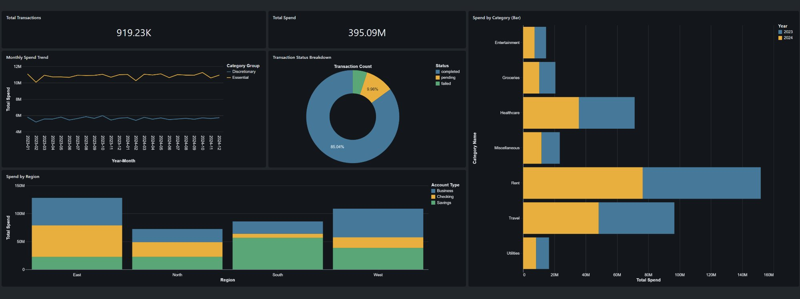

# Finance Analytics Pipeline

End-to-end data engineering pipeline built on Databricks implementing the
Medallion Architecture (Bronze → Silver → Gold) with a synthetic but
realistically messy finance dataset of 1 million transactions.



---

## Architecture

```
Raw CSVs (1,040,000 rows - 9 injected DQ issue types)
        │
        ▼
┌───────────────────────────────────────────────────┐
│  BRONZE  (workspace.bronze)                       │
│  Raw Delta tables - untouched, permanent audit    │
│  + _ingested_at  + _source_file                   │
└───────────────────┬───────────────────────────────┘
                    │
                    ▼
┌───────────────────────────────────────────────────┐
│  SILVER  (workspace.silver)                       │
│  Cleaned, validated, quarantined                  │
│  transactions      → 919,225 rows (clean)         │
│  transactions_quarantine → 120,775 rows (rejected)│
└───────────────────┬───────────────────────────────┘
                    │
                    ▼
┌───────────────────────────────────────────────────┐
│  GOLD  (workspace.gold)                           │
│  Star schema - optimised for analytics            │
│  fct_transactions  (919,225)                      │
│  dim_accounts      (50)                           │
│  dim_date          (1,461)                        │
│  dim_category      (10)                           │
└───────────────────┬───────────────────────────────┘
                    │
                    ▼
        Databricks SQL Dashboard
```

---

## Data Quality Issues Handled

The source dataset was generated with 9 intentional DQ issues to reflect
real-world ingestion scenarios. Silver resolves all of them:

| Issue | Volume | Resolution |
|---|---|---|
| Mixed date formats (4 formats) | All rows | UDF with format detection + ambiguity flag |
| NULL / blank critical fields | ~60,000 | Quarantined with rejection reason |
| Casing inconsistency | ~150,000 | INITCAP / lower normalisation |
| Business key duplicates | ~14,000 | ROW_NUMBER() dedup on natural business key |
| Negative amounts | ~25,000 | ABS() correction + `_amount_corrected` audit flag |
| Out of range dates | ~14,000 | Fixed range validation (2023–2024) |
| Invalid status codes | ~20,000 | Mapping table - fixable corrected, ambiguous quarantined |
| Orphaned account IDs | ~10,000 | Left anti join validation → quarantine |
| Whitespace in text fields | ~50,000 | TRIM() on all string columns |

**Quarantine rate: 11.6%** - all rejected rows preserved with `_rejection_reason`
for upstream diagnosis rather than silent deletion.

---

## Dimensional Model

```
                    dim_date
                   (date_key PK)
                        │
dim_accounts ──── fct_transactions ──── dim_category
(account_key PK)  (transaction_key PK)  (category_key PK)
```

Surrogate keys generated via SHA2-256 on natural keys - deterministic and
idempotent. The same input always produces the same key, making pipeline
reruns safe without key drift or broken joins.

`dim_category` encodes business logic not present in the source system:
category groupings (Essential / Discretionary / Income) and flow direction
(Inflow / Outflow) are modelling decisions version-controlled here.

---

## Key Design Decisions

**Quarantine over delete**
Dropped rows are invisible - bad data disappears and nobody knows why numbers
don't add up. A quarantine table with `_rejection_reason` makes data quality
problems visible, measurable, and fixable at the source.

**Fixed date range validation instead of `current_date()`**
An early bug used `current_date()` to reject future dates. Because the pipeline
ran in February 2026, dates from 2025 were already in the past and passed
validation - letting 13,973 invalid rows through to Silver clean. Fixed by
validating against the known dataset range (2023-01-01 to 2024-12-31).
This surfaced a critical principle: pipeline behaviour must not change based
on when it runs. Idempotency requires absolute conditions, not relative ones.

**SHA2 surrogate keys over auto-increment**
Auto-increment keys require state - the database must remember the last value.
SHA2 of the natural key is stateless, deterministic, and consistent across
pipeline reruns. Running the pipeline twice produces identical keys.

**Business key deduplication over ID deduplication**
Source transaction IDs were all unique - naive `dropDuplicates("transaction_id")`
would have missed every duplicate. Real duplicates in transactional systems
are hidden in the business meaning: same account, same date, same amount, same
category. Window function dedup on the business key caught 14,000 rows that
ID-based dedup would have silently let through.

**Each notebook is self-contained**
UDFs and shared logic are redefined in each notebook rather than imported.
This avoids hidden dependencies between notebooks and makes each one runnable
independently - important for debugging, partial reruns, and onboarding.

---

## Problems Encountered

**Date range validation bug (Silver → Gold)**
Initial quarantine logic used `F.col("transaction_date") > F.current_date()`.
The pipeline ran in February 2026, so injected 2025 dates appeared historical
and passed validation. Foreign key validation in Gold caught 13,973 orphaned
date_keys pointing to dates not in dim_date.

Root fix: replaced `current_date()` with a fixed range check against 2023–2024.
Safety net: extended dim_date spine to 2026 so edge case dates don't break the
pipeline even if they reach Gold in future runs.

---

## Stack

| Layer | Technology |
|---|---|
| Platform | Databricks (Serverless + Classic compute) |
| Storage format | Delta Lake |
| Processing | PySpark + Spark SQL |
| Dashboard | Databricks Lakeview Dashboards |
| Language | Python 3 / SQL |
| Data storage | Unity Catalog (Volumes + managed tables) |

---

## Running the Pipeline

### Prerequisites
- Databricks workspace with Unity Catalog enabled
- Cluster running DBR 13.x LTS or above
- SQL warehouse for dashboard queries

### Steps

```
1. Generate source data locally:
   python data/generate_messy_data.py
   Then upload all 3 CSVs to your Databricks Volume at:
   /Volumes/workspace/landing/raw_finance/

2. Run notebooks in order:
   notebooks/00_bronze_ingestion.py
   notebooks/01_silver_cleaning.py
   notebooks/02_gold_modelling.py

3. Import dashboard:
   Dashboards → Import → dashboard/finance_analytics_dashboard.json
```

### Sanity Check

```sql
SELECT 'bronze'            AS layer, COUNT(*) AS rows FROM workspace.bronze.transactions
UNION ALL
SELECT 'silver_clean',              COUNT(*)         FROM workspace.silver.transactions
UNION ALL
SELECT 'silver_quarantine',         COUNT(*)         FROM workspace.silver.transactions_quarantine
UNION ALL
SELECT 'gold_fact',                 COUNT(*)         FROM workspace.gold.fct_transactions;
```

Expected:
```
bronze             1,040,000
silver_clean         919,225
silver_quarantine    120,775
gold_fact            919,225
```

---

## What Can Be Built on This

**Immediate extensions:**
- `mart_budget_vs_actual` - compare actual spend against budget targets already
  loaded in `workspace.bronze.budget`. The data is there, the model just needs
  a mart that joins them.
- Databricks Workflow job to schedule the pipeline on a trigger or cron.

**Medium term:**
- Replace CSV uploads with Databricks Auto Loader for incremental file ingestion
  - monitors the Volume and processes new files as they arrive.
- SCD Type 2 on `dim_accounts` to track account type changes over time rather
  than overwriting history.

**Longer term:**
- Great Expectations or Databricks data quality rules for contract-based
  assertions - move from ad hoc validation to a formal DQ framework.
- dbt semantic layer on top of Gold for reusable, governed metric definitions
  shared across teams.
- Unity Catalog row and column-level access controls so different teams only
  see the data they are authorised to query.

---

## Repository Structure

```
finance-analytics-pipeline/
├── data/
│   ├── transactions_raw.csv       ← 1,040,000 rows with injected DQ issues
│   ├── accounts_raw.csv           ← 50 accounts
│   └── budget_raw.csv             ← monthly budget targets 2023-2024
├── notebooks/
│   ├── 00_bronze_ingestion.py
│   ├── 01_silver_cleaning.py
│   └── 02_gold_modelling.py
├── dashboard/
│   ├── finance_analytics_dashboard.json
│   ├── DASHBOARD_EXPORT_GUIDE.md
│   ├── screenshots/
│   └── queries/
│       ├── 01_monthly_spend_trend.sql
│       ├── 02_spend_by_category.sql
│       └── 03_05_remaining_queries.sql
├── .gitignore
└── README.md
```

---

## Author

Built as a portfolio project demonstrating production-grade data engineering
patterns - Medallion Architecture, data quality enforcement, dimensional
modelling, and self-serve analytics on Databricks.
